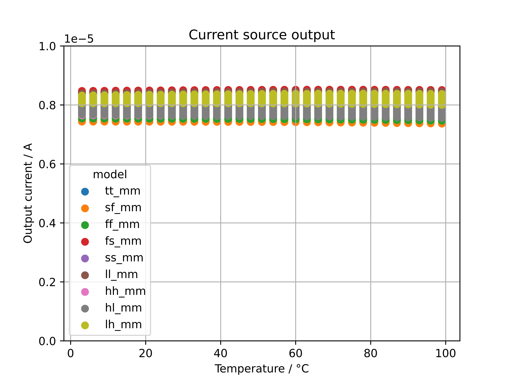
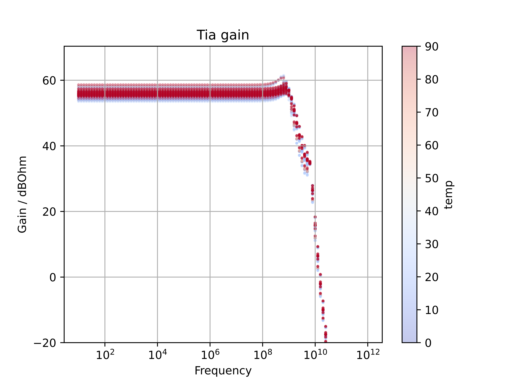
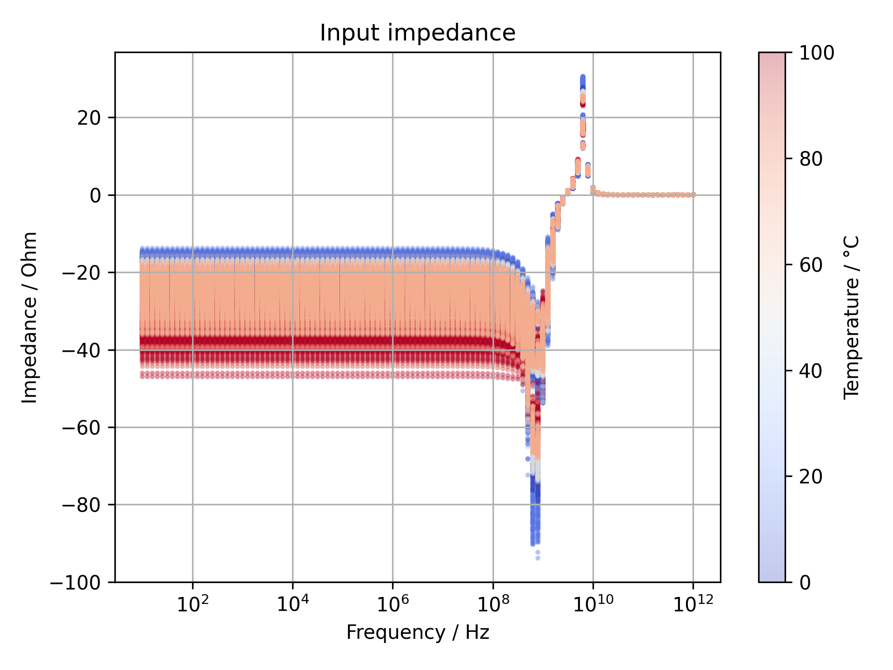
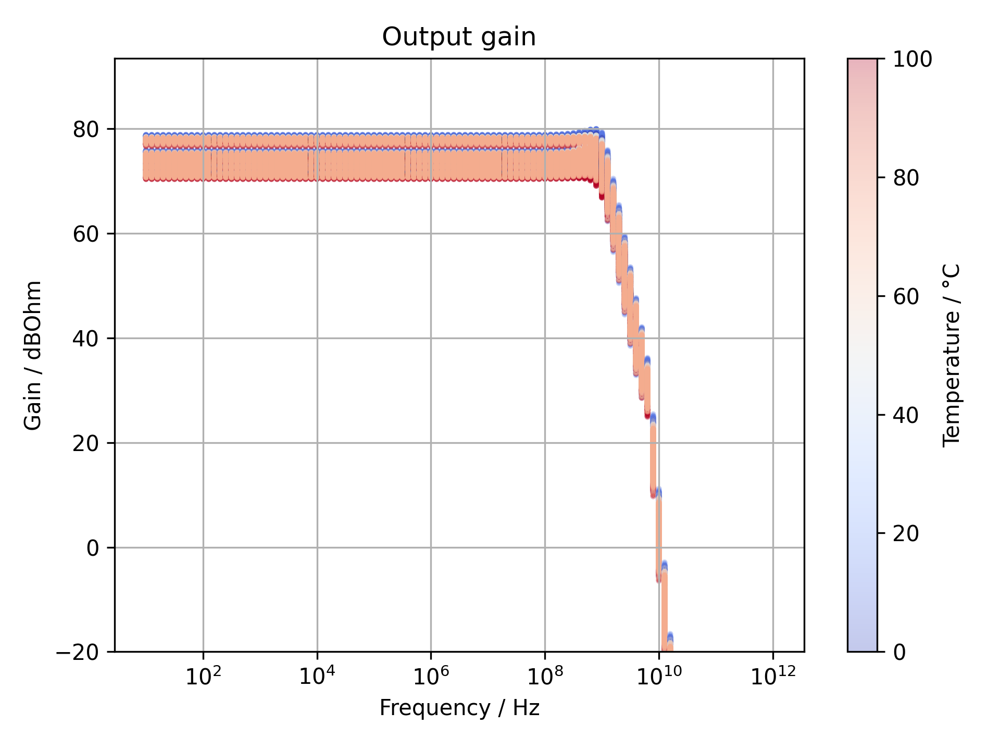

# High bandwidth TIA
In this project a transimpedance amplifier TIA with a nominal bandwidth of 1 GHz, a nominal gain of 70 dBOhm and an input impedance of < 30 Ohm is implemented. The nominal operating voltage is 1.8 V. The output has a nomincal impedance of 50 Ohm and is differential driver intended to drive a load with a capacitance of up to 10 pF.

The TIA design is based on [1]. It is augmented by a on-chip refference current source for biasing based on [2]. Finally a 50 Ohm differential output driver is implemented. For electrostatic discharge (ESD) protection clamping diodes are used.

The circuit is intedended for use as a preamplifier for charaterizing SiC PIN diodes. However, it can find wider use, e.g. in optical communication and in physics experiments. The differential output is intended to be attached to an external high speed ADC or oscilloscope. 

# Reference current source
Post-layout simulations reveal a precision of the current source of +/-10% as shown below. The output of the current source is provided on an analog output via a current mirror for characterization.

# TIA
Simulations show that the the bandwidth of the TIA is between 0.9 and 1.8 GHz depending on the temperature and process variations. However, this bandwidth is not available at the output. It is merely relevant if the TIA is reused in a design where the output is directly processed within the chip. The Gain is between 54 and 60 dBOhm, again this signal is not available at the output of the chip. Please refer to the section Output for detalils on the output characteristics.

# Output driver
The output driver is intended to complement the TIA. Into a 10pF load capacitor it delivers a bandwidth of 0.8GHz or more depending on the temperature and process variations.

# Organization of files
- TIA: 
    - xschem/tia/tia_rgc_core.sch contains the TIA.
    - mag/tia/core/tia_core.mag contains the layout
    - xschem/test/test_tia_rgc_full.sch can be used to testing modifications of the TIA
    - xschem/test/test_tia_rgc_full_mc.sch is intended to check the impact of temperature and process variations on the performance.
- Output driver
    - xschem/outdriver/outdriver.sch contains the circuit
    - mag/outd/outd.mag contains the layout
    - xschem/test/test_outd.sch is used for testing modifications to the output driver
- Low PVT current source:
    - xschem/bias/low_pvt_source.sch contains the circuit
    - mag/isource/isource.mag contains the layout
    - xschem/test/test_tia_rgc_full.sch is used for testing modifications 
    - xschem/test/test_tia_rgc_full_mc.sch is intended to check the impact of temperature and process variations on the performance.
- Integration testing:
    - xschem/test/test_tia_rgc_integration.sch tests the interplay between all components.
    - xschem/test/test_tia_rgc_integration_mc.sch is intended to check the impact of temperature and process variations on the performance.

# License
  

# References
[1] [Low-power 10 Gb/s inductorless inverter based common-drain active feedback transimpedance amplifier in 40 nm CMOS](https://link.springer.com/article/10.1007/s10470-013-0117-8)

[2] [A 65-nm CMOS Constant Current Source With Reduced PVT Variation](https://ieeexplore.ieee.org/document/7792720)
